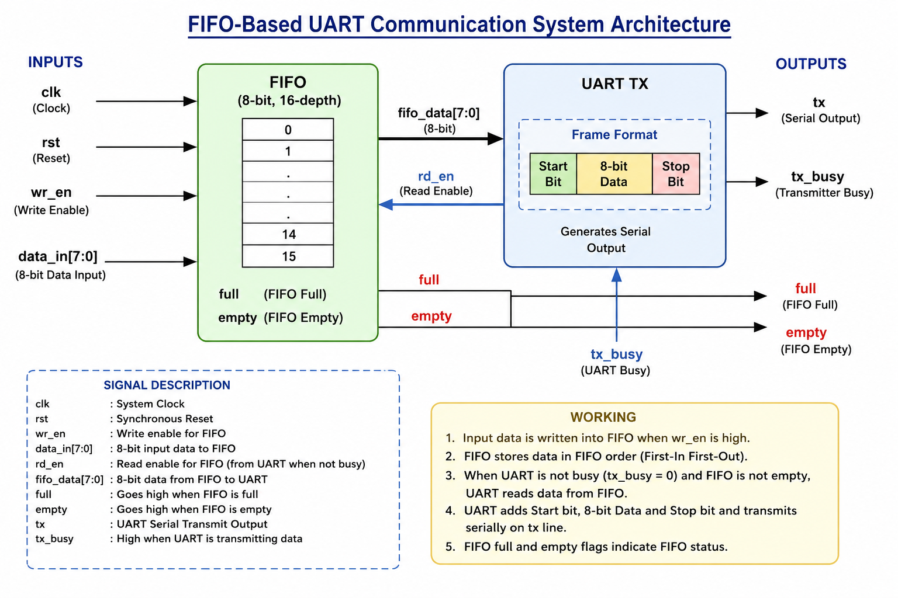
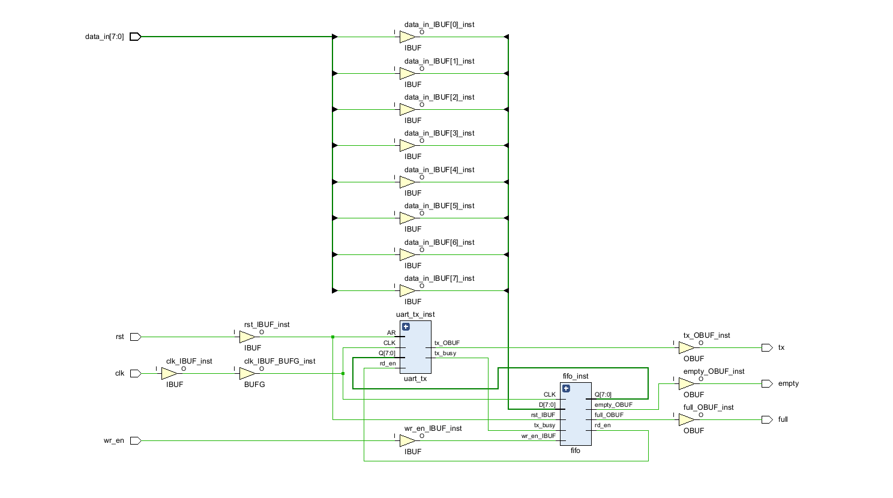

# FIFO-Based UART Communication System using Verilog HDL

## About This Project

This project is a simple implementation of a FIFO-Based UART Communication System using Verilog HDL.

The idea behind this project is to solve the problem of data loss in UART communication. Since UART can transmit only one bit at a time, new incoming data may get lost if the transmitter is busy. To avoid this problem, a FIFO buffer is used before the UART transmitter.

The FIFO stores the incoming data temporarily and sends it to the UART whenever the transmitter becomes free. This helps in transmitting all the data in the correct order without losing any information.

The project was designed and simulated using Xilinx Vivado.

---

## What is UART?

UART (Universal Asynchronous Receiver Transmitter) is a serial communication protocol used to transfer data between two devices.

It uses only two communication lines:

- TX (Transmit)
- RX (Receive)

UART is commonly used in:
- FPGA to PC communication
- Microcontrollers
- Bluetooth modules
- GPS modules
- Serial debugging

---

## What is FIFO?

FIFO stands for **First-In First-Out**.

The first data written into the memory is the first data that comes out.

Example:

```text
Data Written : 55 -> AA -> F0
Data Read    : 55 -> AA -> F0
```

FIFO acts like a queue and temporarily stores data until it is transmitted.

---

## Why use FIFO with UART?

Suppose UART is transmitting:

```text
55
```

Before the transmission is completed, another data arrives:

```text
AA
```

Without FIFO, the new data may be lost because UART is still busy.

By using FIFO:

```text
55 -> AA -> F0
```

all the data is stored and transmitted one by one.

### Advantages
- Prevents data loss
- Buffers incoming data
- Handles burst data efficiently
- Improves communication reliability

---

## Project Architecture

<p align="center">
  
</p>

---

## Synthesized Schematic

<p align="center">
  
</p>

---

## Project Structure

```text
UART-FIFO-Communication-System/
│
├── rtl/
│   ├── uart_tx.v
│   ├── fifo.v
│   └── uart_fifo_top.v
│
├── tb/
│   ├── uart_fifo_tb.v
│   └── uart_fifo_corner_tb.v
│
├── images/
│   ├── uart_fifo_architecture.png
│   └── uart_fifo_schematic.png
│
├── waveforms/
│   ├── functional_waveform.png
│   └── corner_case_waveform.png
│
└── README.md
```

---

## Modules Used

### uart_tx.v
Implements the UART transmitter.

### fifo.v
Implements an 8-bit, 16-depth FIFO memory.

### uart_fifo_top.v
Connects the FIFO and UART modules.

---

## Inputs and Outputs

| Signal | Description |
|---------|-------------|
| clk | System clock |
| rst | Reset signal |
| wr_en | Write enable |
| data_in[7:0] | 8-bit input data |
| tx | UART serial output |
| full | FIFO full flag |
| empty | FIFO empty flag |

---

## Example Working

Input data:

```text
55
AA
F0
```

FIFO stores:

```text
55 -> AA -> F0
```

UART transmits:

```text
55 -> AA -> F0
```

in the same order.

---

## Verification

### Functional Test Cases
- Reset Test
- Single Data Transmission
- Multiple Data Transmission
- FIFO Empty Condition

<p align="center">
  
</p>

### Corner Test Cases
- Reset During Transmission
- Multiple Consecutive Writes
- Write While UART is Busy
- FIFO Overflow Attempt

<p align="center">
  
</p>

---

## Tools Used

- Verilog HDL
- Xilinx Vivado
- XSIM Simulator

---

## Applications

- FPGA communication
- Embedded systems
- Serial interfaces
- Data logging systems
- Sensor interfaces

---

## Skills Gained

- Verilog Coding
- RTL Design
- UART Protocol
- FIFO Design
- Simulation and Verification
- FPGA Development

---

## Author

**Koustubh Shindhe**  
B.E. – VLSI Design and Technology
