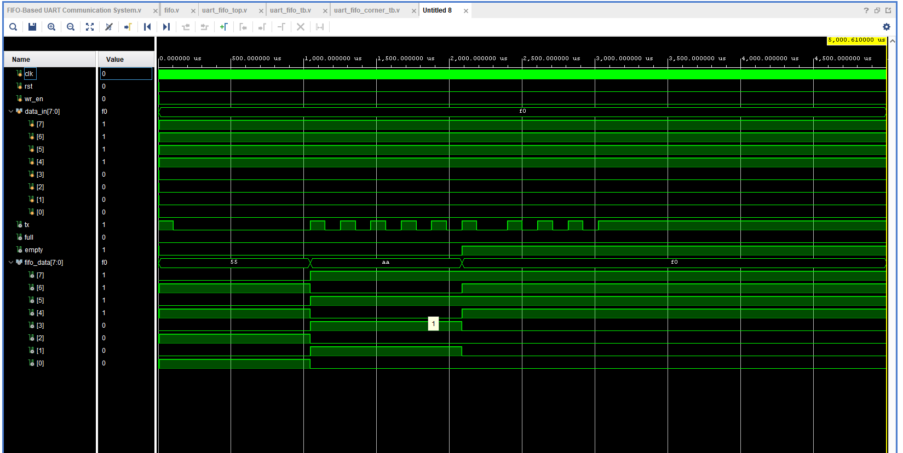
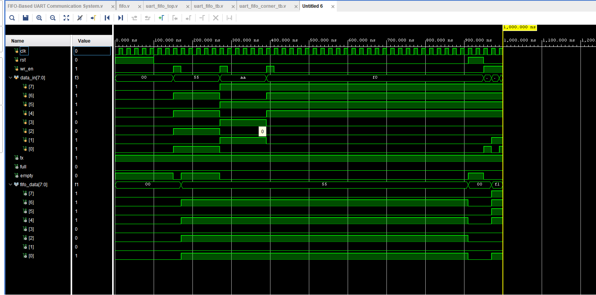

# FIFO-Based UART Communication System using Verilog HDL

## About This Project

This project is a simple implementation of a FIFO-Based UART Communication System using Verilog HDL.

The main idea behind this project is to avoid data loss during UART communication. Since UART can transmit only one bit at a time, incoming data may get lost if the transmitter is busy. To solve this problem, a FIFO buffer is placed before the UART transmitter.

The FIFO temporarily stores the incoming data and sends it to the UART whenever the transmitter becomes free. This ensures that all the data is transmitted in the correct order without any loss.

The project was designed and simulated using Xilinx Vivado and XSIM Simulator.

---

## What is UART?

UART (Universal Asynchronous Receiver Transmitter) is a serial communication protocol used to transfer data between two devices.

It uses two communication lines:

- TX (Transmit)
- RX (Receive)

UART is commonly used in:

- FPGA to PC communication
- Microcontrollers
- Bluetooth modules
- GPS modules
- Serial debugging
- Embedded systems

---

## What is FIFO?

FIFO stands for **First-In First-Out**.

The first data written into the memory is the first data that comes out.

Example:

```text
Data Written : 55 -> AA -> F0
Data Read    : 55 -> AA -> F0
```

FIFO acts like a queue and temporarily stores data until it is transmitted.

---

## Why use FIFO with UART?

Suppose UART is transmitting:

```text
55
```

Before the transmission is completed, another data arrives:

```text
AA
```

Without FIFO, the new data may be lost because UART is still busy.

By using FIFO:

```text
55 -> AA -> F0
```

all the incoming data is stored and transmitted one by one without losing any information.

### Advantages

- Prevents data loss
- Buffers incoming data
- Handles burst data efficiently
- Improves communication reliability
- Decouples the data producer and UART transmitter

---

## Project Architecture

<p align="center">
  
</p>

---

## Synthesized Schematic

<p align="center">
  
</p>

---

## Project Structure

```text
FIFO-Based-UART-Communication-System-using-Verilog/
│
├── rtl/
│   ├── uart_tx.v
│   ├── fifo.v
│   └── uart_fifo_top.v
│
├── tb/
│   ├── uart_fifo_tb.v
│   └── uart_fifo_corner_tb.v
│
├── images/
│   ├── uart_fifo_architecture.png
│   └── uart_fifo_schematic.png
│
├── waveform/
│   ├── functional_waveform.png
│   └── corner_case_waveform.png
│
└── README.md
```

---

## RTL Modules

### uart_tx.v
UART transmitter module that converts parallel data into serial data.

Features:
- Start bit generation
- 8-bit data transmission
- Stop bit generation
- Baud-rate control

---

### fifo.v
8-bit, 16-depth synchronous FIFO.

Features:
- Write operation
- Read operation
- Full flag generation
- Empty flag generation

---

### uart_fifo_top.v
Top module integrating FIFO and UART.

Functions:
- Stores incoming data in FIFO.
- Reads data when UART becomes free.
- Sends data serially through UART.

---

## Inputs and Outputs

| Signal | Description |
|---------|-------------|
| clk | System Clock |
| rst | Reset Signal |
| wr_en | FIFO Write Enable |
| data_in[7:0] | 8-bit Input Data |
| tx | UART Serial Output |
| full | FIFO Full Flag |
| empty | FIFO Empty Flag |

---

## Example Working

Input data:

```text
55
AA
F0
```

FIFO stores:

```text
55 -> AA -> F0
```

UART transmits:

```text
55 -> AA -> F0
```

in the same order without losing any data.

---

## Functional Verification

### Test Cases

- Reset Test
- Single Data Transmission
- Multiple Data Transmission
- FIFO Empty Condition
- UART Serial Transmission

<p align="center">
  
</p>

---

## Corner Case Verification

### Test Cases

- Reset During Transmission
- Multiple Consecutive Writes
- Write While UART is Busy
- FIFO Overflow Attempt

<p align="center">
  
</p>

---

## Applications

- FPGA Communication Systems
- Embedded Systems
- Sensor Interfaces
- Serial Debugging
- Data Logging Systems
- Microcontroller Communication

---

## Tools Used

- Verilog HDL
- Xilinx Vivado
- XSIM Simulator

---

## Skills Demonstrated

- RTL Design
- Verilog Coding
- FIFO Design
- UART Protocol
- Functional Verification
- Corner Case Verification


---

